<div align="center">

# Personalization Intelligence

**From customer behavior to personalization strategy**

A customer-analytics decision-support dashboard that answers one business question:<br/>
**_Where should a company prioritize personalization to create the greatest customer and business value?_**


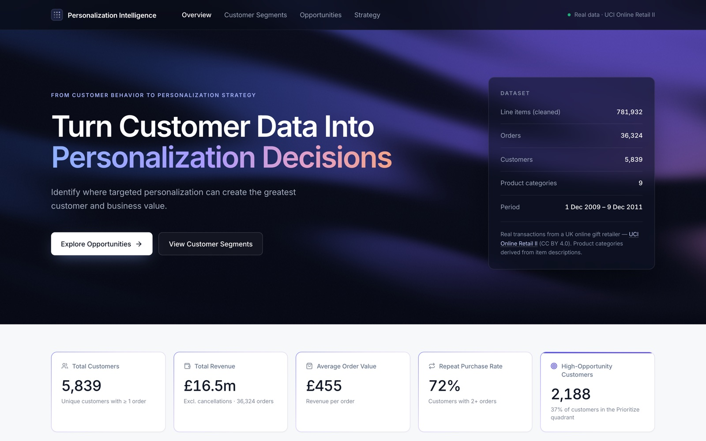

</div>

---

## Contents

1. [The business problem](#the-business-problem)
2. [Key findings](#key-findings)
3. [App tour](#app-tour)
4. [The data](#the-data)
5. [How the analysis works](#how-the-analysis-works)
6. [Architecture](#architecture)
7. [Getting started](#getting-started)
8. [Design decisions](#design-decisions)
9. [Limitations and disclaimer](#limitations-and-disclaimer)
10. [Future improvements](#future-improvements)

---

## The business problem

Personalization (tailored recommendations, targeted offers, loyalty perks) can create real value, but it **costs money** in tooling, content, data work and discounts, and it can feel intrusive when overdone. Customers also differ enormously in how much they are worth and how engaged they are.

So the real question isn't *"should we personalize?"* but **"who should we personalize for, and how much?"**

This project turns raw transaction data into that decision. A strategy or marketing manager can open it and quickly answer:

| Question | Where it's answered |
|---|---|
| How valuable are our customers? | **Overview** |
| Who are they, as groups? | **Customer Segments** |
| Where does personalization have the most potential? | **Personalization Opportunities** |
| What should we do for each group, and how do we measure it? | **Strategy** |

> **Motivation.** This builds on earlier academic research on *AI Hyper-Personalisation and Consumer Trust*, which studied the consumer side: how privacy concerns shape trust and acceptance. This project explores the complementary business side: even if personalization creates value, **should a company personalize every customer equally?**

---

## Key findings

From the cleaned **UCI Online Retail II** data: **5,839 customers · 36,324 orders · £16.5m revenue · £455 average order value · 72% repeat purchase rate.**

| Segment | Customers | % of customers | % of revenue | Avg order value | Opportunity score | Matrix quadrant | Investment |
|---|---:|---:|---:|---:|---:|---|---|
| 🔵 High-Value Loyalists | 1,633 | 28% | **78%** | £512 | 68 | Prioritize | High |
| 🟠 High-Potential | 1,321 | 23% | 14% | £348 | 46 | Maintain | Medium |
| 🟢 New / Emerging | 708 | 12% | 2% | £368 | 40 | Deprioritize | Low |
| ⚪ Low-Engagement | 2,177 | 37% | **6%** | £270 | 23 | Deprioritize | Low |

- **Value is highly concentrated.** 28% of customers (Loyalists) generate **78%** of revenue.
- **There's a long low-value tail.** 37% of customers generate only **6%** of revenue.
- **Value is at risk.** **598** High-Potential customers haven't purchased in 180+ days.
- **Loyalists buy bigger baskets.** £512 average order value vs £455 overall (+13%).
- **New customers are an early-stage bet.** Their segment averages "Deprioritize", yet 106 of them already score as "Prioritize": a case for low-cost, automated second-purchase journeys.

**Core insight: personalization should not be deployed uniformly.** Effort should follow value and opportunity.

---

## App tour

### 1 · Overview

Headline KPIs, an auto-generated executive snapshot and the customer value-vs-engagement landscape.

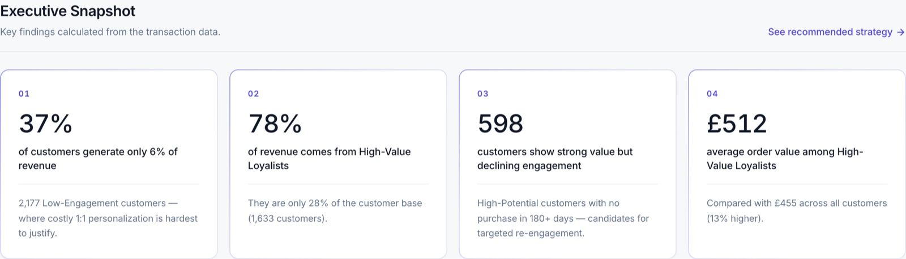

Every insight sentence is **generated from the data**, not typed in, so the narrative updates if the data changes.

<table>
<tr>
<td width="62%">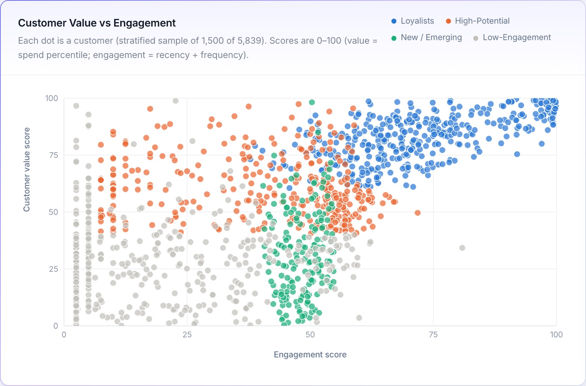</td>
<td width="38%">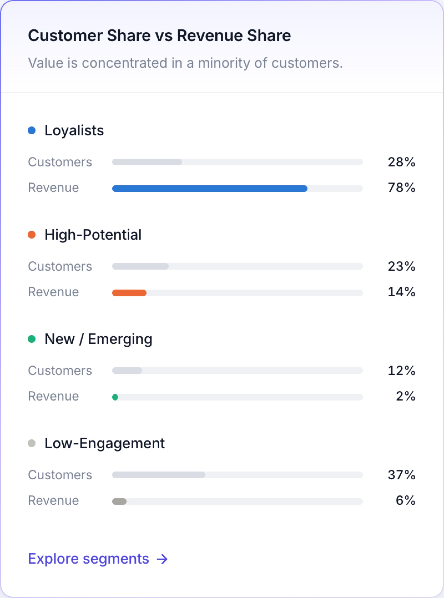</td>
</tr>
<tr>
<td><sub>Each dot is a customer, coloured by segment. Top-right = valuable and active.</sub></td>
<td><sub>The core argument in one chart: customer share vs revenue share per segment.</sub></td>
</tr>
</table>

### 2 · Customer Segments

Four transparent, rule-based segments with a filter, a detail panel and supporting charts.

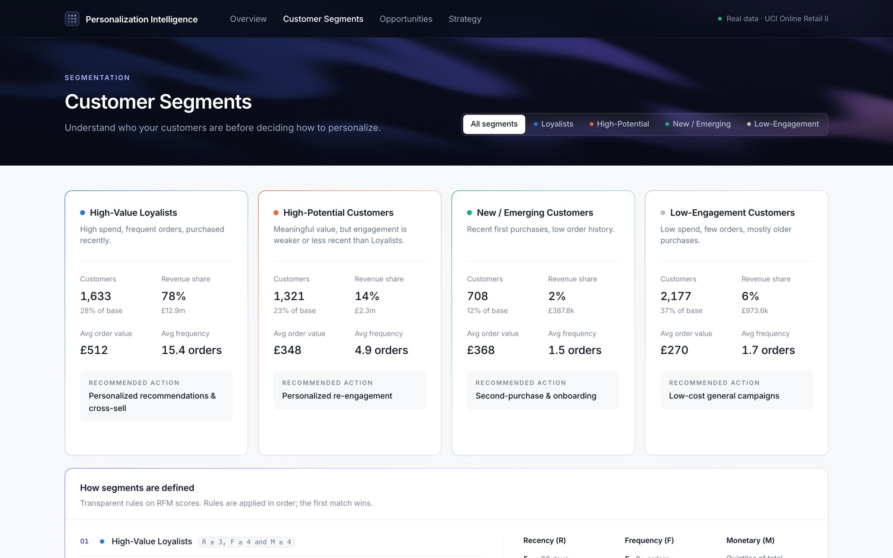

Selecting a segment opens a detail panel with its averages, the exact segment rule, the recommended action and the investment level:

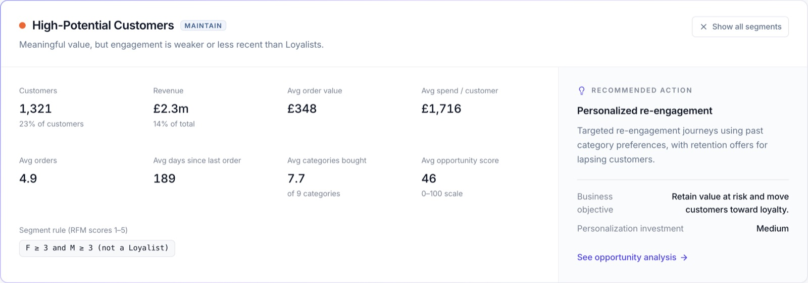

<table>
<tr>
<td width="50%">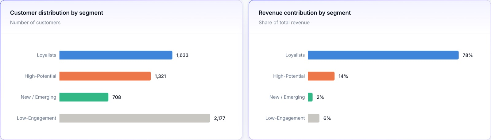</td>
<td width="50%">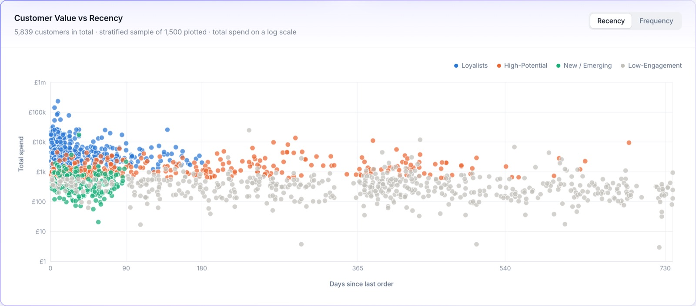</td>
</tr>
<tr>
<td><sub>Customer distribution vs revenue contribution by segment.</sub></td>
<td><sub>Total spend (log scale) vs days since last order; toggles to number of orders.</sub></td>
</tr>
</table>

### 3 · Personalization Opportunities (the core page)

The **Personalization Opportunity Matrix** plots customer value against personalization opportunity. Bubbles are segments, sized by customer count; faint dots are individual customers.

<table>
<tr>
<td width="66%">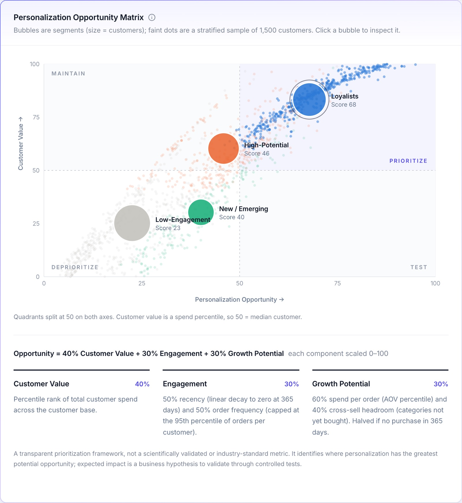</td>
<td width="34%">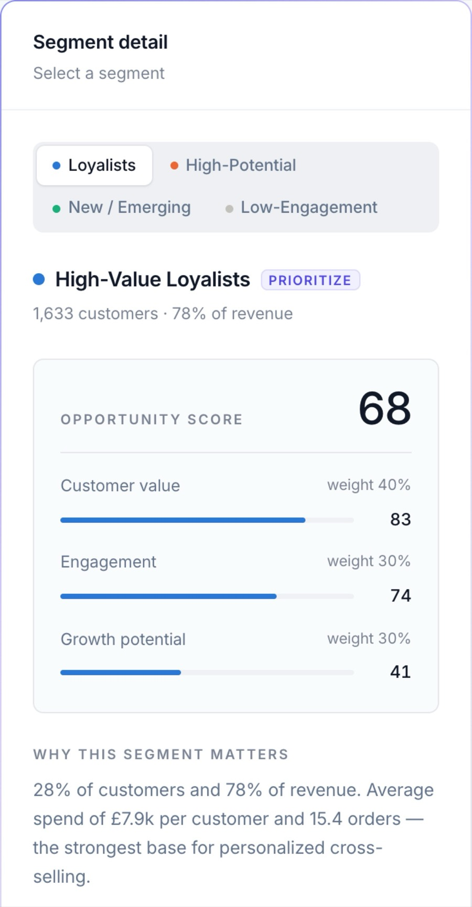</td>
</tr>
<tr>
<td><sub>Quadrants split at 50: Prioritize · Maintain · Test · Deprioritize.</sub></td>
<td><sub>Score breakdown for the selected segment.</sub></td>
</tr>
</table>

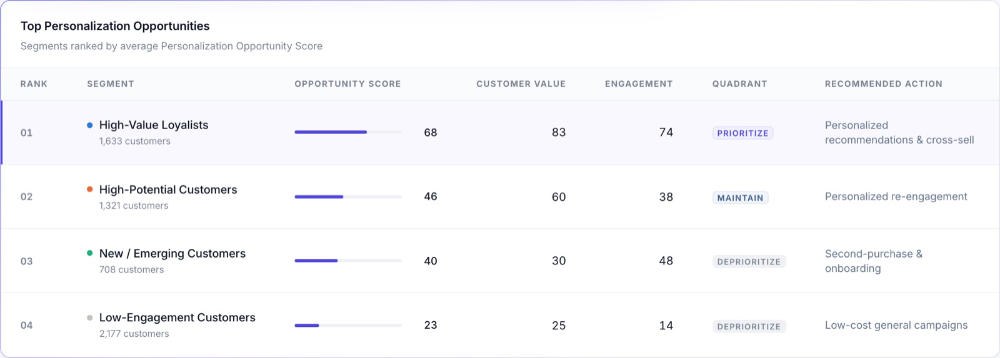

### 4 · Recommended Strategy

A consulting-style recommendation page: the core insight, four strategies tied to segment data, and a measurement framework.

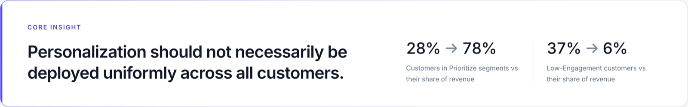
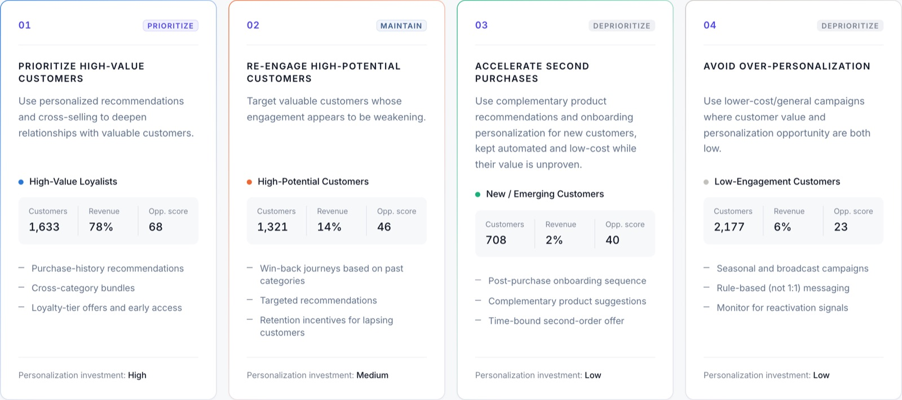
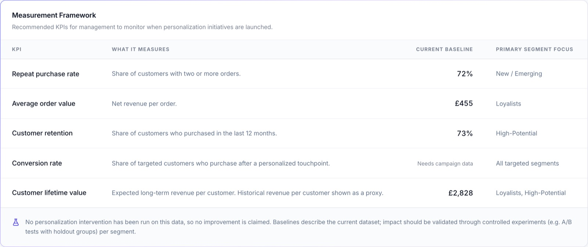

| # | Strategy | Segment | What to do | Investment |
|---|---|---|---|---|
| 01 | Prioritize high-value customers | Loyalists | Personalized recommendations, cross-category bundles, loyalty perks | High |
| 02 | Re-engage high-potential customers | High-Potential | Win-back journeys based on past categories, retention offers | Medium |
| 03 | Accelerate second purchases | New / Emerging | Automated, low-cost onboarding and complementary-product journeys | Low |
| 04 | Avoid over-personalization | Low-Engagement | Broad seasonal campaigns, rule-based messaging | Low |

---

## The data

**[UCI Online Retail II](https://archive.ics.uci.edu/dataset/502/online+retail+ii)** contains real transactions of an anonymised UK-based online gift-ware retailer (many customers are wholesalers), from **1 Dec 2009 to 9 Dec 2011**. Values are in GBP.

> Chen, D. (2019). *Online Retail II* [Dataset]. UCI Machine Learning Repository. https://doi.org/10.24432/C5CG6D. Licensed **CC BY 4.0**.

### Cleaning pipeline

[`scripts/prepare-online-retail.py`](scripts/prepare-online-retail.py) (pandas) turns the raw workbook into the file the app reads. The audit trail below is saved to [`src/data/dataset-meta.json`](src/data/dataset-meta.json).

| Step | Why | Line items left |
|---|---|---:|
| Raw line items (two yearly sheets) | — | 1,067,371 |
| Remove invoices duplicated across the two sheets | The sheets overlap in early Dec 2010 | 1,044,848 |
| Remove lines without a Customer ID | A customer must be identifiable | 809,561 |
| Remove cancellation lines | Cancellations are not purchases | 791,115 |
| Remove purchases reversed by a matching cancellation | Prevents cancelled orders from inflating spend | 784,685 |
| Remove non-positive quantity or price | Data-entry errors | 784,616 |
| Remove non-product codes (postage, fees, adjustments, vouchers) | Not product sales | **781,932** |

The cleaned line items are aggregated to **36,324 orders** (one row per invoice: date, customer, product categories, units, revenue) from **5,839 customers**, about 0.6 MB compressed, so it loads quickly in a browser.

**Handled transparently:**
- **Product categories:** the source has none, so 9 categories are derived from item descriptions with ordered keyword rules (e.g. *MUG, TEAPOT* → Kitchen & Dining; *CHRISTMAS, PARTY* → Seasonal & Party). Unmatched items become *Other Gifts* (≈11% of revenue).
- **Discounts:** none in the source, so revenue = quantity × unit price.

---

## How the analysis works

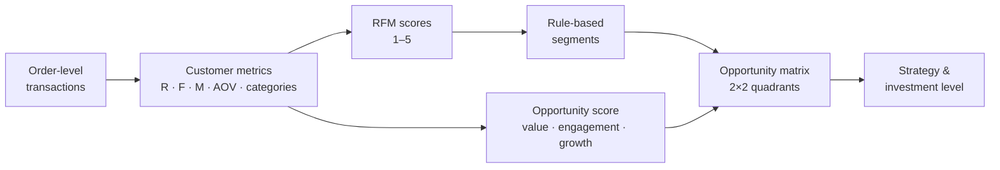

### 1 · Customer metrics
For each customer: **Recency** (days since last order), **Frequency** (distinct orders), **Monetary** (total revenue), average order value, and the number of distinct categories bought.

### 2 · RFM scores (1–5)

| Score | Recency | Frequency | Monetary |
|:-:|---|---|---|
| 5 | ≤ 30 days | 8+ orders | top 20% of spend |
| 4 | 31–90 days | 5–7 orders | 60–80th percentile |
| 3 | 91–180 days | 3–4 orders | 40–60th percentile |
| 2 | 181–365 days | 2 orders | 20–40th percentile |
| 1 | > 365 days | 1 order | bottom 20% |

Recency and frequency use fixed, readable bands. Monetary uses quintiles (cut-offs on this data: £282 · £600 · £1,199 · £2,868).

### 3 · Segments (rules applied in order; first match wins)

| Segment | Rule | In plain words |
|---|---|---|
| High-Value Loyalists | `R ≥ 3, F ≥ 4, M ≥ 4` | Bought in the last 6 months, 5+ orders, top 40% spend |
| High-Potential | `F ≥ 3, M ≥ 3` | Real value, but weaker or less recent engagement |
| New / Emerging | `R ≥ 4, F ≤ 2` | Bought in the last 90 days, only 1–2 orders |
| Low-Engagement | everyone else | Low spend, few orders, mostly old purchases |

### 4 · Personalization Opportunity Score (0–100)

```
Opportunity = 40% × Customer Value + 30% × Engagement + 30% × Growth Potential
```

| Component | Question | Calculation |
|---|---|---|
| **Customer Value** | Are they valuable already? | Percentile rank of total spend |
| **Engagement** | Are they active now? | 50% recency (linear decay to 0 at 365 days) + 50% frequency (capped at the 95th percentile) |
| **Growth Potential** | Is there room to grow? | 60% AOV percentile + 40% cross-sell headroom (categories not yet bought); halved if no purchase in 12 months |

<details>
<summary><b>Worked example: a real Loyalist (customer 15532)</b></summary>

Last order 26 days ago · 10 orders · £3,693 spent · bought all 9 categories → R = 5, F = 5, M = 5 → **Loyalist**

- **Value** = 84.8 (spends more than ~85% of customers)
- **Engagement** = ½ × 100 × (1 − 26/365) + ½ × 100 × (10/20) = ½ × 92.9 + ½ × 50 = **71.4**
- **Growth** = 0.6 × 69.3 (AOV percentile) + 0.4 × 0 (no categories left to cross-sell) = **41.6**
- **Opportunity** = 0.4 × 84.8 + 0.3 × 71.4 + 0.3 × 41.6 = **67.8**

Even a top customer doesn't score 100: they already buy everything, so there's little cross-sell headroom.
</details>

### 5 · Opportunity matrix and investment

Customers and segments are placed by **Customer Value** (y) against **Opportunity** (x), split at 50:

| Quadrant | Meaning | Recommended investment |
|---|---|---|
| **Prioritize** | High value, high opportunity | High |
| **Maintain** | High value, lower opportunity: protect and retain | Medium |
| **Test** | Lower value, high opportunity: run experiments | Low (test & learn) |
| **Deprioritize** | Lower value, lower opportunity | Low |

Each segment's investment level is **derived from its quadrant**, so the strategy can never contradict the analysis.

---

## Architecture

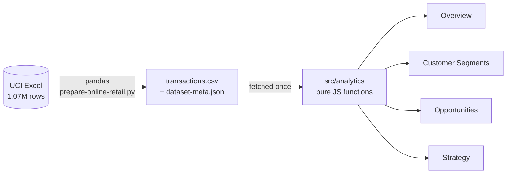

| Layer | Technology |
|---|---|
| Data preparation | Python, pandas, openpyxl |
| Frontend | React 19, Vite, React Router |
| Styling | Tailwind CSS 4, custom WebGL "silk" header background |
| Charts | Recharts |
| Icons | Lucide React |

```
src/
├── analytics/          # business logic, no UI
│   ├── parseTransactions.js   order-level CSV → records
│   ├── rfm.js                 calculateRFM(): metrics + 1–5 scores
│   ├── segments.js            segment rules, actions, segmentCustomers()
│   ├── opportunity.js         calculateOpportunityScore(), quadrants, investment
│   ├── kpis.js                calculateKPIs(), segment summaries
│   ├── insights.js            generateInsights(): data-driven sentences
│   └── pipeline.js            runs the whole chain
├── components/         # layout, shared UI, charts, silk background
├── pages/              # Overview, Segments, Opportunities, Strategy
├── data/               # transactions.csv, dataset-meta.json
└── utils/              # formatting, stratified sampling for plots
scripts/
├── prepare-online-retail.py   raw UCI workbook → cleaned order-level CSV
└── verify-analytics.mjs       prints every metric for checking
```

---

## Getting started

```bash
git clone https://github.com/SiddhantYadav13/personalization-intelligence.git
cd personalization-intelligence
npm install
npm run dev
```

| Command | What it does |
|---|---|
| `npm run dev` | Start the local dev server |
| `npm run build` | Production build into `dist/` |
| `npm run preview` | Serve the production build locally |
| `npm run verify:analytics` | Print KPIs, segment table and insights in the terminal |
| `npm run prepare:data -- path/to/online_retail_II.xlsx` | Rebuild the dataset from the raw UCI file (needs `pandas` and `openpyxl`) |

The repo is ready for static hosting (e.g. Vercel). `vercel.json` rewrites all routes to the single-page app.

---

## Design decisions

- **Transparent rules over black-box ML.** RFM bands, segment rules and score weights can each be explained to a business stakeholder, which makes the output something a manager can trust, question and act on.
- **Business logic separated from UI.** All calculations live in `src/analytics/` as pure functions; React components only display results.
- **No backend.** The dataset is static, and the full analysis runs in the browser in under a second. A backend would only be needed for live data.
- **Order-level data file.** One row per order keeps every customer metric exact while cutting the file from about 12 MB (line-level) to 4.9 MB (about 0.6 MB compressed).
- **Stratified sampling for scatter plots.** Plots draw 1,500 customers, keeping each segment's share, to stay responsive; every KPI, segment and score uses all 5,839 customers.
- **Deterministic.** No randomness anywhere: the same data always produces the same results.

---

## Limitations and disclaimer

This project uses a public dataset (UCI Online Retail II, CC BY 4.0) of an anonymised retailer and is a portfolio demonstration.

- The **Personalization Opportunity Score is a prioritization framework**, not a causal or predictive measure of personalization ROI. Recommendations are business hypotheses to validate.
- **No personalization intervention has been run.** Recommended KPIs (repeat purchase rate, AOV, retention, conversion, CLV) are things to measure, not results achieved.
- Product categories are **derived heuristically** from item descriptions.
- Value is measured as **revenue, not margin**. The data covers a single retailer, 2009–2011, with many wholesale customers.
- The 40 / 30 / 30 weights are a **judgement-based starting point**, to be calibrated with experiment results.

---

## Future improvements

- A/B tests with holdout groups to measure the real impact of personalization per segment
- Causal uplift modelling to target the customers most likely to respond
- Predictive customer lifetime value (e.g. BG/NBD) and margin-based value
- Cohort retention analysis
- The retailer's own product taxonomy instead of keyword-derived categories
- A production database and backend API for live data
